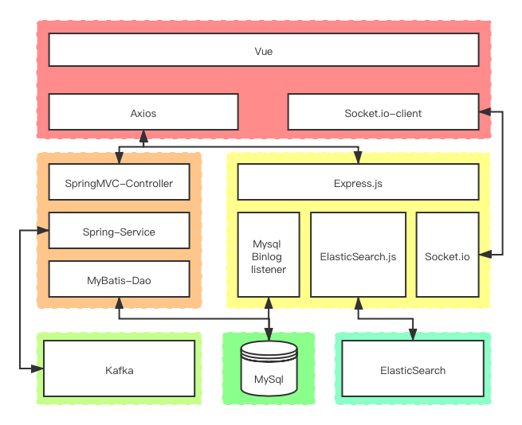

# ZUCC课堂问答系统

原开源地址：[Vue前端](https://github.com/lychs1998/QA-bbs-front)，[ES消息推送与搜索服务](https://github.com/lychs1998/EMS-Message-push)

## 项目简介

课堂问答系统为学生提供了一个新的提问和解决问题的渠道，不仅方便了教师收集和回答学生的问题，还能提高课堂问题反馈效率和知识再利用率。

前端：使用Vue框架和Vuetify组件库
后端：使用的是SSM框架和Express框架，并利用Kafka和ElasticSearch提供消息推送服务和全文检索服务。
数据库：使用MySql，并利用Mysql binlog将数据同步到ElasticSearch中。

## 项目结构图



## 功能特性

- 实现首页问题列表动态加载
- 实现登录/注销功能
- 实现Markdown编辑与渲染
- 实现提问与回答功能
- 实现问题详情页的渲染
- 实现token鉴权、存储与过期
- 实现修改密码功能
- 实现UI全局响应式，遵循Material Design设计规范。
- 实现收藏、点赞与访问统计功能
- 实现编辑器图片上传功能
- 实现Markdown编辑器在手机端与电脑端自适应
- 实现用户主页，可点击用户头像进入他人主页。
- ES与MySql数据同步
- 实现基于ElasticSearch的搜索功能
- 实现问题有回答时的点对点推送(基于Socket.io)
- 实现将教师所提的问题推送给所有学生的发布-订阅服务
- 使用路由守卫在转跳前判断用户权限，如果没有登录，则转跳到登录页面。

## 项目部署

安装Node.js后使用npm安装@vue/cli

```bash
npm install @vue/cli -g

//如果官方源速度过慢，建议更换npm源为国内淘宝源
npm config set registry https://registry.npm.taobao.org
```

克隆并下载安装Vue部分的node_modules

```bash
git clone https://github.com/Stanph/QASystem.git
cd QASystem
cd Vue
npm install
```

Mac下安装tomcat(9.022)、zookeeper(3.414)、kafka(2.31)、mysql(8.0.16)、elasticsearch(5.12)后启动相应服务

```bash
brew services start tomcat 
brew services start zookeeper
brew services start kafka 
brew services start mysql 
cd elasticsearch-5.1.2 //转到es安装目录
./bin/elasticsearch //启动es
```

下载安装Express部分的node_modules并运行mysql binlog和elasticsearch服务

```bash
cd ../Express
npm install

//修改index.js中的数据库连接账号，且修改Mysql配置文件，打开binlog
//运行
node index.js
```

==注意==Mysql8.0以上变更了密码的加密方式，会报错，可参考下面的SQL语句修改加密方式。

```mysql
 -- 记得将下面的root和password修改为你想要修改的用户名与密码
 ALTER USER 'root'@'localhost' IDENTIFIED BY 'password' PASSWORD EXPIRE NEVER;
 ALTER USER 'root'@'localhost' IDENTIFIED WITH MYSQL_NATIVE_PASSWROD BY 'password' ;
```

运行QASystemStructure.sql建立MySql数据库
运行QASystemData.sql插入数据（可选）

使用vue cli 3.x版本的UI界面运行项目

```bash
vue ui
```

浏览器访问`http://localhost:8000`打开Vue CLI的可视化管理界面，点击导入，选择git clone下的Vue文件。导入后，点击`任务-build-运行`后生成dist文件。

将tomcat目录中webapps/ROOT下的所有文件替换为dist中的文件
SSM后端部分打成war包复制到tomcat目录下的webapps里
访问网站http://localhost:8080

## 项目运行展示
首页
问题列表可按时间或收藏量排序


提问页面
提供Markdown编辑


问题详情及回答页面
提供收藏问题和回答的功能
提供浏览量统计功能


搜索页面
对问题及回答全文检索，关键字高亮显示


个人主页
提供统计信息功能
显示本人问题及回答


点对点消息推送
通过监听回答表insert事件，当此问题所属用户socket.io保持连接时直接向前端推送回答，当其未连接时，将回答存进ES中，在该用户登录后进行推送。


发布与订阅消息推送
教师所提问题存入Kafka，学生登录后自动拉取。


## 本人主要工作
- Mysql数据库建立
- 后端SSM搭建（Resources中的配置文件、Service服务接口层和服务实现层、Mapper接口及其对应的映射文件、Controller层设置路由路径和参数预处理及结果返回）
- 主要实现功能接口如下：
- - 登录 /user/login
- - 密码修改 /user/changePwd
- - 个人主页 /user/home
- - 首页问题列表 /question/questionList
- - 问题详情 /question/questionDetail
- - 提问 /question/addQuestion
- - 问题点赞或取消 /question/qstar
- - 回答 /answer/addAnswer
- - 回答点赞或取消 /answer/astar
- - 所赞问题列表 /starQuestion/sqlist
- - 所赞回答列表 /starAnswer/salist
- ES搜索关键字高亮显示
- Kafka消息推送

## 未来工作
设置一级学科和二级学科类别（见ClassStructure.sql），划分课程进行管理。
搜索框改用v-autocomplete做相关内容推荐。


